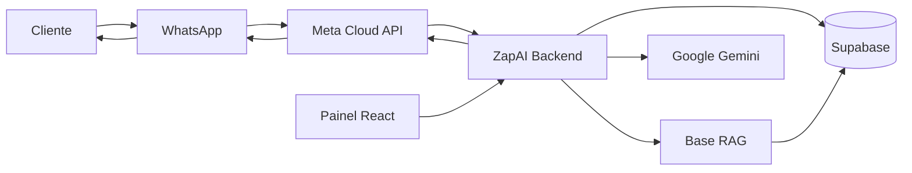

# ZapAI

> Sua atendente digital no WhatsApp.

A **ZapAI** é uma plataforma SaaS multi-tenant que permite que empresas criem, configurem e ensinem uma atendente digital para conversar com clientes diretamente pelo **WhatsApp Cloud API oficial da Meta**.

A proposta é simples:

**Você ensina. A Zap atende, lembra, organiza e chama você quando precisa.**

A plataforma foi pensada principalmente para pequenos e médios negócios que querem automatizar parte do atendimento sem precisar entender de prompts, modelos de IA ou infraestrutura.

🌐 **Aplicação:** https://zapai-iota.vercel.app/

---

## O que a ZapAI faz

Cada empresa pode ter sua própria Zap, com:

- personalidade e tom de voz próprios;
- instruções específicas do negócio;
- base de conhecimento independente;
- histórico de conversas;
- memória de longo prazo por contato;
- atendimento automático pelo WhatsApp;
- possibilidade de atendimento humano;
- organização dos contatos;
- ambiente para testar a atendente antes de colocá-la em produção.

A arquitetura é horizontal: a mesma plataforma pode ser utilizada por lojas, clínicas, restaurantes, imobiliárias, oficinas, prestadores de serviços, pet shops, times comerciais e outros tipos de negócio.

---

## Principais funcionalidades

### Atendimento pelo WhatsApp

Integração com a **WhatsApp Cloud API oficial da Meta**, utilizando Webhooks e Graph API.

O fluxo básico é:

```text
Cliente
   │
   ▼
WhatsApp
   │
   ▼
Meta Cloud API
   │
   ▼
Webhook ZapAI
   │
   ├── identifica o tenant pelo Phone Number ID
   ├── identifica ou cria o contato
   ├── recupera histórico
   ├── recupera memória do cliente
   ├── consulta a base de conhecimento
   ├── gera a resposta
   ├── salva a conversa
   └── responde pelo WhatsApp
```

Não utiliza automação por navegador, WhatsApp Web ou leitura de QR Code.

---

### Atendente personalizada

Cada tenant pode configurar sua própria atendente.

Entre as configurações disponíveis estão:

- nome da atendente;
- prompt/instruções;
- objetivo do atendimento;
- comportamento;
- tom de comunicação;
- informações sobre a empresa.

A ideia do produto é esconder a complexidade técnica sempre que possível e permitir que o empreendedor configure a Zap usando linguagem natural.

---

### Base de conhecimento com RAG

Cada empresa possui uma base de conhecimento isolada.

A Zap pode aprender a partir de:

- texto digitado;
- páginas e sites;
- documentos DOCX;
- arquivos PDF;
- imagens com conteúdo textual.

O conteúdo é processado, dividido em trechos e transformado em embeddings.

Durante uma conversa, a Zap realiza busca semântica na base daquele tenant e injeta os conteúdos relevantes no contexto da resposta.

```text
Pergunta do cliente
       │
       ▼
Embedding da pergunta
       │
       ▼
Busca vetorial
       │
       ▼
Conteúdo relevante
       │
       ▼
Prompt + memória + histórico + RAG
       │
       ▼
Resposta
```

---

### Memória de longo prazo

Além do histórico da conversa, a Zap mantém memória estruturada sobre cada contato.

Depois dos atendimentos, o sistema pode extrair informações relevantes como:

- nome;
- preferências;
- interesse de compra;
- objeções;
- orçamento;
- necessidades;
- dúvidas recorrentes.

Esses dados podem ser reutilizados em conversas futuras para evitar que o cliente precise repetir tudo novamente.

---

### Teste da atendente

A plataforma possui um ambiente de teste separado do WhatsApp real.

Ele utiliza:

- prompt atual do tenant;
- histórico de teste;
- base de conhecimento;
- busca semântica.

Assim, é possível validar o comportamento da Zap antes de colocá-la para falar com clientes.

---

### Conversas e atendimento humano

O painel centraliza as conversas recebidas pelo WhatsApp e permite acompanhar os contatos e o histórico de mensagens.

A arquitetura também suporta o controle do atendimento automático para permitir intervenção humana quando necessário.

O objetivo não é fazer a IA resolver tudo, mas automatizar o que faz sentido e facilitar a passagem para uma pessoa nos casos que exigem decisão humana.

---

### Multi-tenant

A ZapAI foi construída como SaaS multi-tenant.

Cada empresa possui seu próprio:

- tenant;
- usuário;
- número do WhatsApp;
- contatos;
- mensagens;
- prompt;
- configuração;
- base de conhecimento;
- memória;
- contexto de atendimento.

O `tenantId` é obtido através da autenticação e utilizado para separar os dados de cada negócio.

---

## Arquitetura



### Frontend

- React
- Vite
- React Router
- Tailwind CSS
- Framer Motion
- Lucide Icons

### Backend

- Node.js
- Express
- JWT
- Axios
- Google Generative AI SDK

### Dados

- Supabase
- PostgreSQL
- estrutura multi-tenant
- armazenamento de mensagens
- base vetorial de conhecimento

### Integrações

- WhatsApp Cloud API / Meta Graph API
- Google Gemini
- Supabase

---

## Estrutura do projeto

```text
zapai/
│
├── frontend/
│   ├── public/
│   └── src/
│       ├── components/
│       ├── context/
│       ├── pages/
│       ├── api.js
│       └── ...
│
├── prompts/
│   └── templates e prompts por contexto
│
├── scripts/
│   └── migrations e scripts auxiliares
│
├── src/
│   ├── middleware/
│   ├── mocks/
│   ├── routes/
│   │   ├── admin.js
│   │   └── auth.js
│   ├── utils/
│   └── index.js
│
├── tests/
│   ├── integration/
│   └── ...
│
├── package.json
└── README.md
```

---

# Executando localmente

## Pré-requisitos

Tenha instalado:

- Node.js
- npm
- uma conta/projeto no Supabase;
- uma aplicação configurada no Meta for Developers;
- acesso à WhatsApp Cloud API;
- uma chave da API do Google Gemini.

---

## 1. Clone o projeto

```bash
git clone https://github.com/flavio-silva0/zapai.git
cd zapai
```

---

## 2. Instale as dependências do backend

```bash
npm install
```

---

## 3. Instale as dependências do frontend

```bash
cd frontend
npm install
cd ..
```

---

## 4. Configure as variáveis de ambiente

Crie um arquivo `.env` na raiz.

Exemplo:

```env
PORT=3001

# Google Gemini
GEMINI_API_KEY=your_gemini_api_key

# Supabase
SUPABASE_URL=https://your-project.supabase.co
SUPABASE_SERVICE_KEY=your_service_role_key

# JWT
JWT_SECRET=use_a_long_random_secret

# Meta / WhatsApp
META_VERIFY_TOKEN=your_webhook_verify_token

# Bootstrap do administrador
ADMIN_EMAIL=admin@example.com
ADMIN_PASSWORD=change_me
ADMIN_NOME=Admin
```

Outras configurações do agente, RAG, timeout e geração podem ser ajustadas por variáveis adicionais existentes no backend.

---

## 5. Configure o frontend

Em produção, configure:

```env
VITE_API_URL=https://api.seudominio.com
```

No ambiente de desenvolvimento, o frontend pode utilizar o proxy local configurado no Vite.

---

# Desenvolvimento

## Backend

```bash
npm run dev
```

Por padrão:

```text
http://localhost:3001
```

---

## Frontend

Em outro terminal:

```bash
npm run frontend
```

ou:

```bash
cd frontend
npm run dev
```

Por padrão, o Vite utilizará algo como:

```text
http://localhost:5173
```

---

# Scripts

## Backend

```bash
npm start
```

Inicia o servidor.

```bash
npm run dev
```

Inicia o backend em modo watch.

```bash
npm test
```

Executa a suíte de testes do backend.

---

## Frontend

```bash
cd frontend
```

```bash
npm run dev
```

Servidor de desenvolvimento.

```bash
npm run build
```

Build de produção.

```bash
npm run lint
```

Lint do frontend.

```bash
npm run preview
```

Preview local do build.

---

# WhatsApp Cloud API

A ZapAI utiliza a integração oficial da Meta.

Para conectar um número são necessários os dados fornecidos pela plataforma da Meta, como:

- Phone Number ID;
- credenciais de acesso;
- configuração do webhook.

Configure o webhook da aplicação apontando para o endpoint do backend responsável por receber os eventos do WhatsApp.

Exemplo:

```text
https://api.seudominio.com/webhook/whatsapp
```

O token de verificação deve ser o mesmo definido em:

```env
META_VERIFY_TOKEN=...
```

Inscreva a aplicação nos eventos necessários do WhatsApp, incluindo mensagens.

> A ZapAI não depende de WhatsApp Web, Puppeteer ou leitura de QR Code para manter sessões conectadas.

---

# Autenticação

A autenticação do painel utiliza JWT.

Fluxo simplificado:

```text
Cadastro / Login
      │
      ▼
Backend
      │
      ▼
JWT
      │
      ▼
Frontend
      │
      ▼
Authorization: Bearer <token>
      │
      ▼
Rotas protegidas
```

O token contém informações utilizadas pelo backend para identificar o usuário, role e tenant correspondente.

Existem dois contextos principais:

### Tenant

Usuário de uma empresa específica.

Tem acesso apenas aos recursos relacionados ao seu próprio negócio.

### Super Admin

Conta administrativa da plataforma, utilizada para funções de gerenciamento global.

---

# Segurança

Algumas das proteções implementadas na aplicação incluem:

- autenticação JWT;
- isolamento por tenant;
- hash de senhas com bcrypt;
- validação de mensagens geradas antes do envio;
- limites de tamanho de respostas;
- tratamento de timeout;
- retries com backoff;
- idempotência de mensagens recebidas;
- separação da base de conhecimento por tenant;
- validação de URLs antes da ingestão;
- controle de acesso a rotas administrativas.

Credenciais da Meta, Supabase, JWT ou Gemini nunca devem ser commitadas no repositório.

---

# Robustez do processamento

O pipeline do WhatsApp possui mecanismos para reduzir problemas comuns de produção.

Entre eles:

### Idempotência

Mensagens recebidas possuem controle para evitar processamento duplicado do mesmo evento.

### Retry e backoff

Falhas temporárias do provedor de IA podem ser retentadas automaticamente.

### Timeout

Chamadas externas possuem limites de tempo para impedir processos presos indefinidamente.

### Sanitização de resposta

Antes de uma mensagem gerada ser salva ou enviada, ela passa por validações e sanitização.

### Limites de mensagem

Respostas são tratadas para respeitar limites configuráveis de tamanho e quantidade de mensagens enviadas ao WhatsApp.

---

# Base de conhecimento

O endpoint de conhecimento permite criar, atualizar e remover informações específicas de cada tenant.

Fluxo:

```text
Fonte
  │
  ├── Texto
  ├── URL
  ├── DOCX
  ├── PDF
  └── Imagem
       │
       ▼
Extração de conteúdo
       │
       ▼
Chunking
       │
       ▼
Embeddings
       │
       ▼
Supabase
       │
       ▼
Busca semântica durante a conversa
```

---

# Princípios de produto

A ZapAI está sendo desenvolvida com alguns princípios centrais.

### A tecnologia deve ficar nos bastidores

O usuário não precisa entender LLM, embeddings, RAG ou engenharia de prompt para configurar sua atendente.

### A Zap deve aprender com o negócio

A configuração deve ficar progressivamente melhor conforme o empreendedor adiciona conhecimento e utiliza o sistema.

### IA não precisa resolver tudo

Quando necessário, uma pessoa deve conseguir assumir a conversa.

### Contexto importa

Histórico, memória do contato e conhecimento da empresa devem trabalhar juntos.

### Horizontal sem ser genérico

A mesma infraestrutura deve funcionar para diferentes segmentos sem obrigar todos os negócios a terem o mesmo comportamento.

---

# Status do projeto

A ZapAI está em desenvolvimento ativo.

### Implementado / em funcionamento

- [x] SaaS multi-tenant
- [x] Cadastro e autenticação
- [x] JWT
- [x] WhatsApp Cloud API oficial
- [x] Recebimento de mensagens via webhook
- [x] Respostas utilizando Google Gemini
- [x] Histórico de conversas
- [x] Painel web
- [x] Personalização da atendente
- [x] Base de conhecimento
- [x] Busca vetorial / RAG
- [x] Ingestão de URL
- [x] Ingestão de DOCX
- [x] Ingestão de PDF
- [x] Ingestão de imagens
- [x] Ambiente de teste da atendente
- [x] Memória de longo prazo por contato
- [x] Idempotência de mensagens
- [x] Retry e tratamento de falhas

### Em evolução

- [ ] experiência de onboarding
- [ ] analytics baseados integralmente em dados reais
- [ ] follow-ups inteligentes
- [ ] insights automáticos das conversas
- [ ] visualização da memória do cliente no painel
- [ ] aprendizado por correção de conversas
- [ ] Shadow Mode
- [ ] conexão do WhatsApp mais simples para o usuário final
- [ ] billing self-service
- [ ] integrações adicionais
- [ ] melhorias contínuas de UX e responsividade

---

# Roadmap de produto

A visão de longo prazo da ZapAI vai além de responder mensagens.

O objetivo é construir uma atendente capaz de:

```text
Atender
   ↓
Entender
   ↓
Lembrar
   ↓
Organizar
   ↓
Aprender
   ↓
Encontrar oportunidades
   ↓
Chamar o humano quando necessário
```

Algumas frentes planejadas:

### Zap quer aprender

Identificar perguntas que a atendente não soube responder e permitir que o dono ensine a resposta diretamente pelo painel.

### Memória visível

Exibir de forma simples o que a Zap sabe sobre cada cliente.

### Radar de oportunidades

Identificar clientes que podem precisar de follow-up ou retomada comercial.

### Insights

Transformar as conversas em informações úteis sobre dúvidas, objeções e demandas recorrentes.

### Shadow Mode

Permitir que a Zap acompanhe conversas e sugira respostas antes de receber autonomia para responder diretamente.

---

# Deploy

Uma arquitetura de produção possível é:

```text
Frontend
   │
   └── Vercel

Backend
   │
   └── Node.js / Express
       em serviço compatível

Banco
   │
   └── Supabase

WhatsApp
   │
   └── Meta Cloud API
```

O frontend utiliza `VITE_API_URL` para descobrir o endereço da API em produção.

---

# Testes

O backend possui testes relacionados a:

- segurança das mensagens geradas;
- tratamento de possíveis alucinações;
- integração;
- webhook.

Execute:

```bash
npm test
```

Antes de enviar alterações do frontend:

```bash
cd frontend
npm run lint
npm run build
```

---

# Aviso

Este projeto ainda está em desenvolvimento ativo.

Interfaces, modelos de dados, integrações e fluxos podem sofrer alterações conforme o produto evolui.

Não exponha em commits:

```text
.env
Access Tokens da Meta
Service Role Key do Supabase
JWT Secret
Gemini API Key
```

---

## ZapAI

**Seu WhatsApp atendido, mesmo quando você não está.**

https://zapai-iota.vercel.app/
